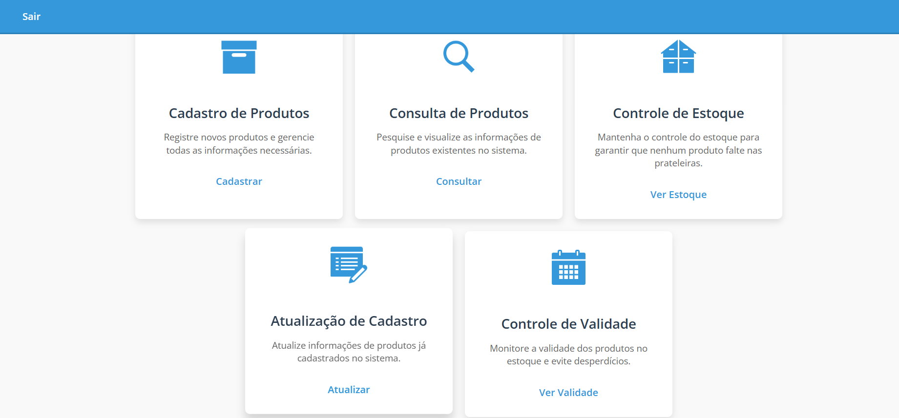
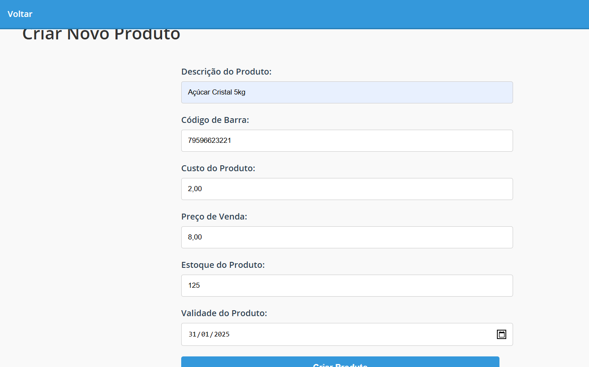
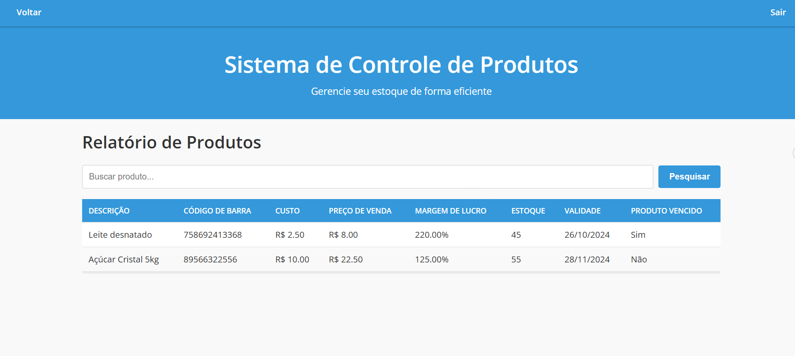
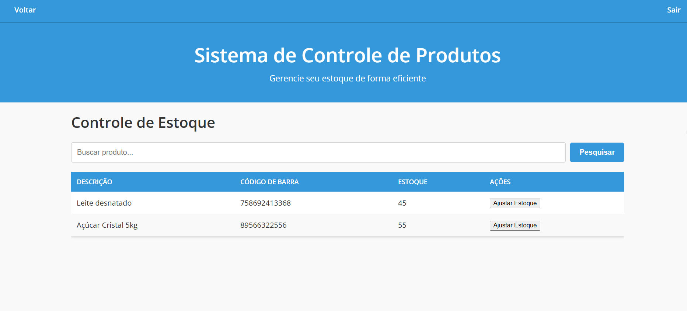
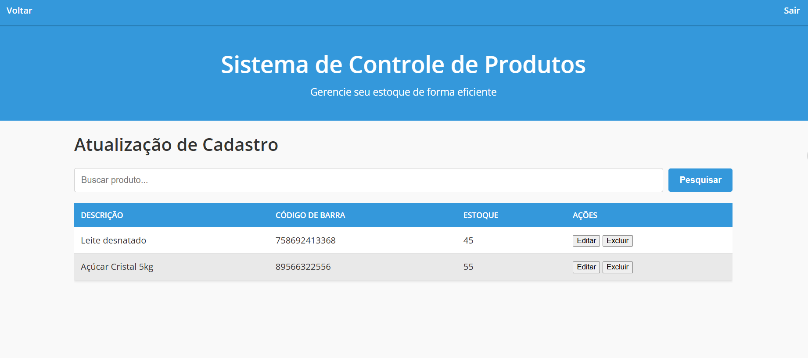
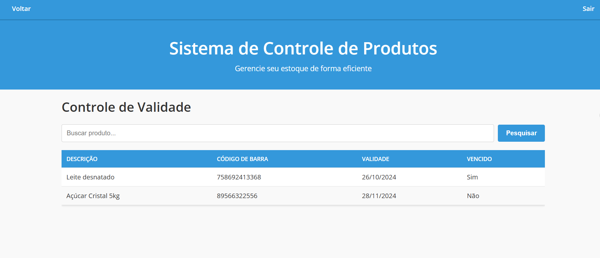

<h1 align="center"> Projeto Efistock</h1>

<div align="center">
 
</div>

Um sistema web para o controle de produtos em supermercados, com foco em gerenciar estoques, cadastrar e consultar produtos, e monitorar prazos de validade

## Índice

* [Funcionalidades do Efistock](#funcionalidades)
* [Layout](#layout)
* [Tecnologias Utilizadas](#tecnologias)
* [Como rodar este projeto?](#rodar)
* [Autores do Projeto](#autores)


## 🖥️ Funcionalidades do Efistock

 -[x]Cadastro de produtos 

 -[x]Consulta de produtos

 -[x]Controle de estoque 

 -[x]Atualização do cadastro de produtos

 -[x]Controle de validade

 -[x]Log-in

 -[x]Log-out


## 💻 Layout








## 🛜 Técnicas e Ferramentas Utilizadas
* [XAMPP](https://www.apachefriends.org/) 
* [JavaScript](https://developer.mozilla.org/pt-BR/docs/Web/JavaScript)
* [PHP](https://www.php.net/) 
* [VS CODE](https://code.visualstudio.com/)

## ⚙️ Como rodar este projeto?
```bash
# Clone esse repositório 
$ git clone linkdorepositório
# Acesse a pasta do projeto no seu terminal 
$ cd nomedapasta
# Instale as dependências - Para PHP 
$ composer install
# Para JavaScript 
$ npm install
# ou
$ yarn install
#Configuração do XAMPP
#Inicie o Apache e o MySQL pelo painel de controle do XAMPP.
#Mova o projeto para o diretório htdocs do XAMPP para que o Apache possa servir os arquivos (ou altere o caminho nas configurações do Apache, se necessário).
#Execute o projeto
# Abra seu navegador e acesse 
http://localhost/nomedapasta para ver o projeto rodando.
```


## 🧑🏽‍💻 Autores do Projeto
| [<br><sub>Emily Santos</sub>](https://github.com/emilydevelopersantos) |  [<br><sub>Gabriel Oliveira</sub>](https://github.com/guilhermeonrails) |  [<br><sub>Guilherme Santos</sub>](https://github.com/alexfelipe) | [<br><sub>Roberta Isidoro</sub>](https://github.com/usuario4) | [<br><sub>William Lima</sub>](https://github.com/usuario5) |
| :---: | :---: | :---: | :---: | :---: |


 